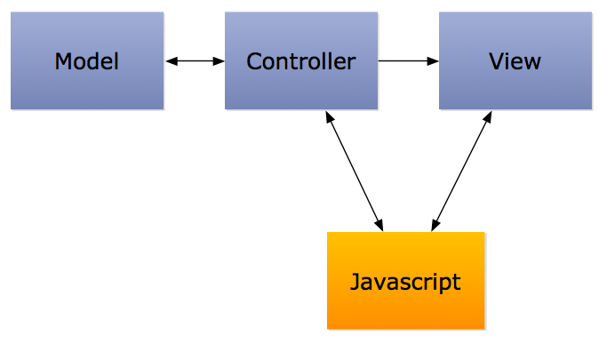
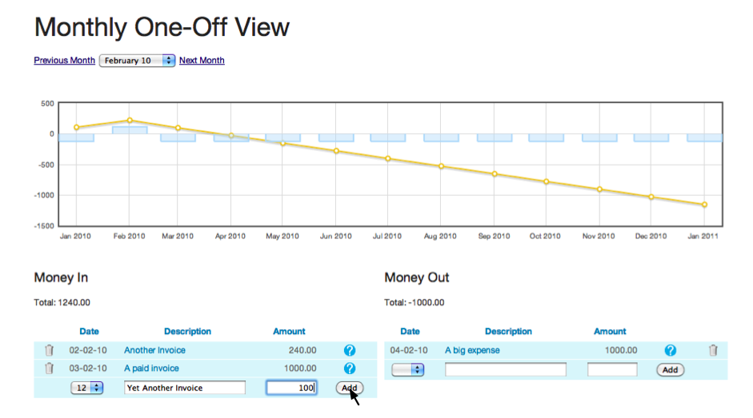
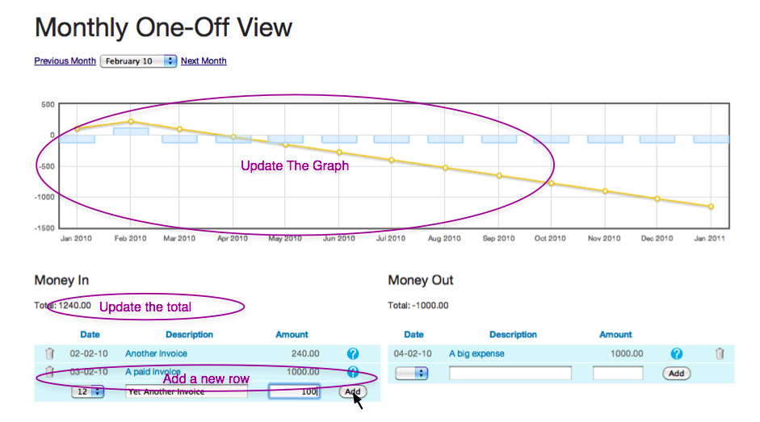

!SLIDE 
# Jelly #

## ScotRUG ##
### Philip Roberts ###
### 17 June 2010 ###

!SLIDE center
# Where does Javascript go? #

!SLIDE bullets incremental left
# Rails Prototype/JRails Helpers #
* Fine for simple actions
* Hard work if you need to make lots of changes after AJAXy operations
* Quickly gets messy with lots of different AJAXy functionality

!SLIDE bullets incremental
# Jelly #
* Unobtrusive Javascript "Framework"
* Written by Pivotal Tracker guys
* Fits into Rails conventions nicely
* Unit-testable JS, with Jasmine (apparently)

!SLIDE center
#A Quick Example#

!SLIDE center full-page

!SLIDE center full-page

!SLIDE small
    @@@ Javascript
    //Public/Pages/cashflows.js

    Jelly.Pages.add("Cashflows", {

      monthly: function() {
        $('#new_income_form').ajaxForm(
          $.ajaxWithJelly.params()
        );
        //Any other JS/JQuery
      },

      ...

    }

!SLIDE smaller
    @@@ Ruby
    # Controller
    def create
      ...
      respond_to do |format|

        format.html do 
          #response if JS disabled
        end

        format.js do
          jelly_callback("successful_create_monthly") do
            #This list is returned to Jelly:
            [ render :partial => "table_rows",  #html for table
              entry_type                        #expense/income
              new_total                         
            ]
          end
        end

      ...

!SLIDE smaller
    @@@ Javascript
    //Public/Pages/cashflows.js

    Jelly.Pages.add("Cashflows", {

      ...

      on_successful_create_monthly:
        function(table_html, entry_type, new_total) {
          //Any JQuery you like
          $('#'+entry_type+'_tbody').html(table_html);
          $('#cashflow_plot').load('/cashflows/plot');
          $('#'+entry_type+'_total').text(new_total);
        },

      ...
    }
              
!SLIDE bullets
#Gotchas#
* Don't spend ages thinking you've done your Javascript wrong without checking that your controller is returning something sensible.
* AJAXForm plugin...

!SLIDE small
# AJAXForm Plugin #
    @@@ Javascript
    $('#the_form').ajaxForm($.ajaxWithJelly.params());

!SLIDE bullets
# The End #
* [http://github.com/pivotal/jelly](http://github.com/pivotal/jelly)
